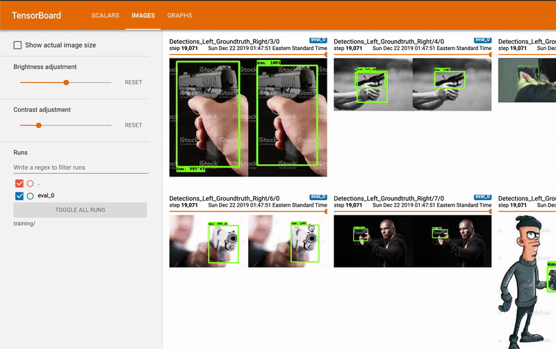
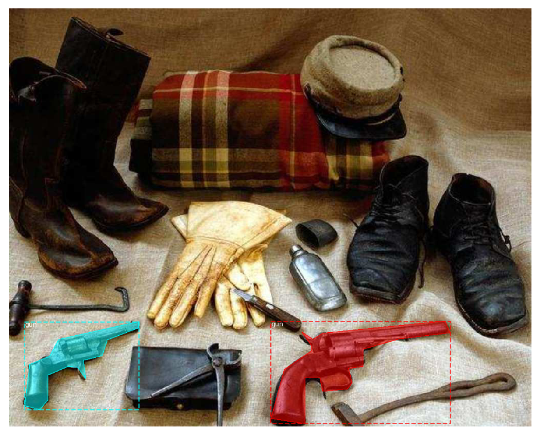
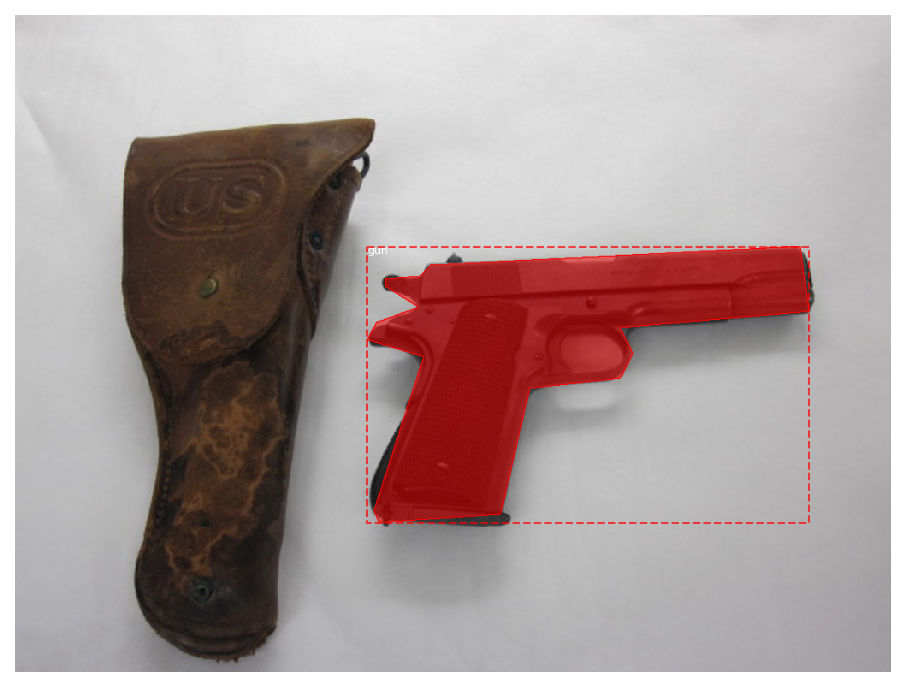
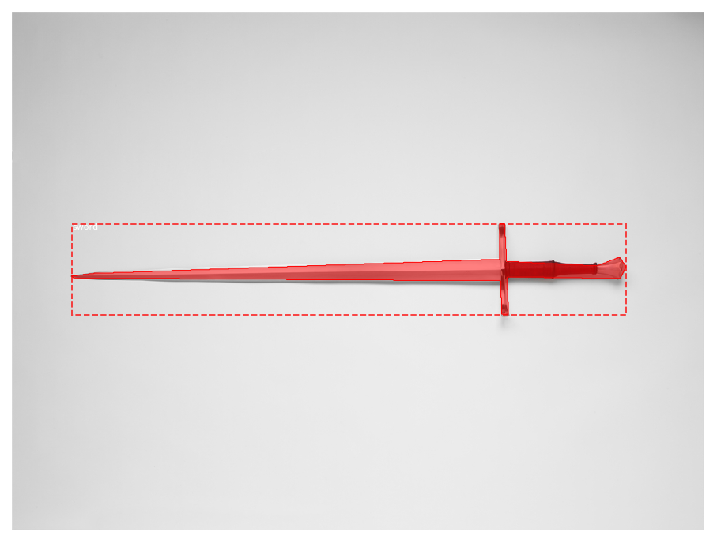
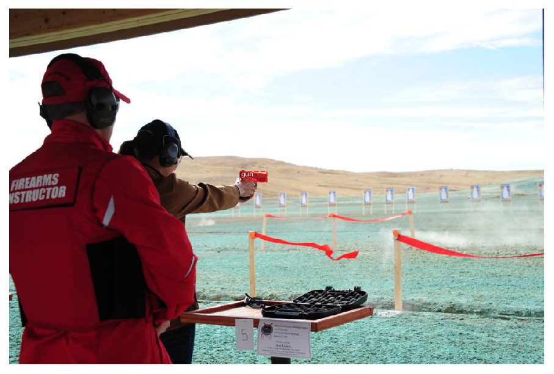

# 🔫🚨 Weapons Detection 🔪🎥  



---

## 📝✨ Overview  
Welcome to **Weapons Detection in Real-Time Surveillance Videos**! 🎉  
This project uses **Deep Learning & Computer Vision 🤖** to detect **weapons** like guns 🔫 and knives 🔪 in real-time CCTV surveillance footage 📹.  
It’s built for **security systems, law enforcement 🛡️, and smart city monitoring 🏙️**.  

---

## 🌟 Features  
- 🔍 **Real-Time Weapon Detection** – Instantly detect guns and knives from live feeds or videos  
- 🖥️ **Easy-to-Run Scripts** – Start detection with just one command  
- 🏋️ **Training Support** – Retrain the model with your own dataset  
- 🖼️ **Visual Results** – Bounding boxes drawn on detected weapons  
- ⚡ **High Accuracy** – Uses pre-trained SSD TensorFlow model  
- 🚀 **Future-Ready** – Easily upgrade to newer models like YOLOv8  
- 🔔 **Alerts & Notifications (future)** – Integrate real-time alert system  

---

## 📂 Project Structure  

```bash
Weapons-Detection-in-Real-Time-Surveillance-Videos/
│── train.py                    # Script for training the model 🏋️
│── direct_test.py              # Script for testing on videos/live feeds 🎥
│── frozen_inference_graph.pb   # Pre-trained TensorFlow model 🤖
│── requirements.txt            # Dependencies 📜
│── *.ipynb                     # Jupyter notebooks for experiments 🧪
│── results.gif                 # Example detection output 📊
│── README.md                   # (This file) 📝
```
---

## 🛠️ Installation Steps  

1️⃣ **Clone the Repository** 🌀  
```bash
git clone https://github.com/yourusername/Weapons-Detection-in-Real-Time-Surveillance-Videos.git
cd Weapons-Detection-in-Real-Time-Surveillance-Videos
```  

2️⃣ **Install Dependencies** 📦  
```bash
pip install -r requirements.txt
```  

3️⃣ **Download/Use Pretrained Model** 🤖  
A pre-trained model (`frozen_inference_graph.pb`) is already included, so you can start right away 🚀.  

---

## 🚀 How to Use  

### 🎥 Run Detection on a Video File  
```bash
python direct_test.py --video your_video.mp4
```  

### 📡 Run Detection on Live Webcam  
```bash
python direct_test.py --webcam
```  

### 🏋️ Train Your Own Model  
```bash
python train.py
```  

💡 *Tip:* You can modify `direct_test.py` to customize detection thresholds 🎚️  

---

## 📊 Results Showcase  

| Input Frame 🖼️ | Detected Frame ✅ |
|-------------|----------------|
|  |  |
|  |  |

---

## 🌱 Future Scope  
- 🧠 Upgrade to YOLOv8 for faster detection ⚡  
- ☁️ Deploy as a **cloud-based API** for remote security 🛰️  
- 📱 Create a **mobile app** for real-time alerts & push notifications 🔔  
- 🕵️ Integrate with **facial recognition** for suspect identification 🧑‍💻  
- 🔐 Build a **centralized dashboard** for monitoring multiple cameras at once 🖥️  

---

## 💡 Benefits  
- 🛡️ **Enhanced Security** – Prevent crimes before they happen  
- 🕑 **Time-Saving** – Automated monitoring reduces human effort  
- 🌍 **Scalable** – Deploy across multiple cameras and locations  
- 📡 **Real-Time Alerts** – Quick action can be taken during emergencies  
- 💸 **Cost Effective** – Open-source and easily deployable  

---

## 🤝 Contributing  
Contributions are welcome! 🎉  
1. 🍴 Fork this repository  
2. 🛠️ Make your changes  
3. 🚀 Submit a pull request  

---

## 📝 License  
📜 This project is open-source and available under the **MIT License**.  

---

## ❤️ Acknowledgements  
- TensorFlow 🧠  
- OpenCV 📷  
- Community Contributors 🙌  

---

